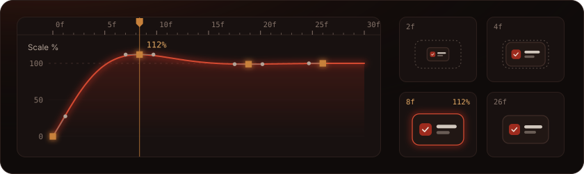
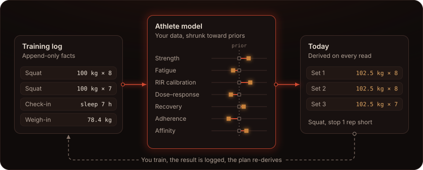
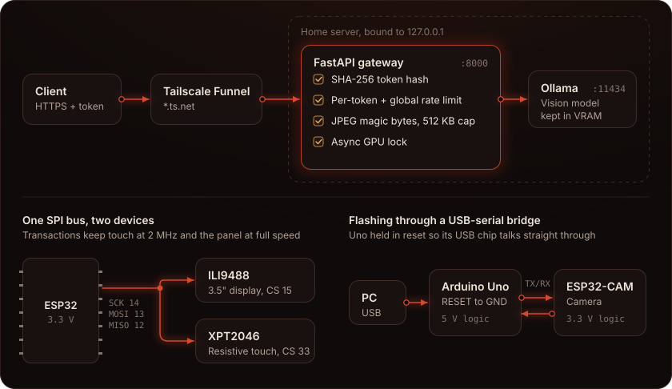
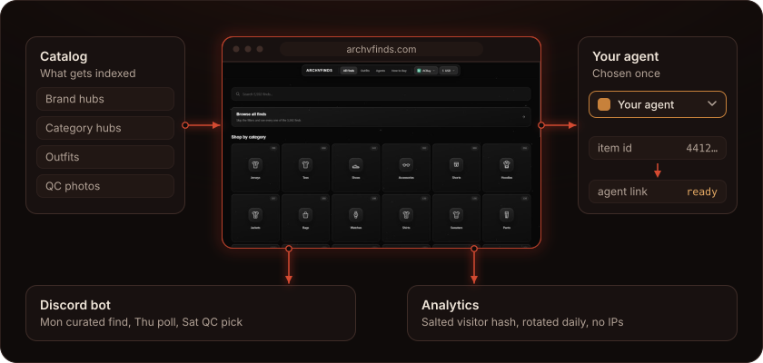

<h1 align="center">Hi 👋, I'm Alfred</h1>
<h3 align="center">Student · VFX artist · SaaS animation · AI</h3>

## Overshoot

I make motion for software: launch films, demo videos and product animation that moves the way a good interface feels to use. Everything is keyframed by hand in After Effects, often on real interfaces rebuilt layer by layer. Booking from Q1 2027.

<picture><source media="(prefers-color-scheme: dark)" srcset="assets/button-overshoot-dark.svg"></picture>

## Selected projects

### Protocol

A strength-training coach built on a statistical model of the athlete. It reads an append-only training log and works out today's session: which movements, what load and how many reps in each set.

- Seven parameters fitted to each athlete's own data and shrunk toward population priors until the data can carry them
- Exact load and reps for every set, corrected for how the athlete reports reps in reserve
- Deloads fire on modelled fatigue debt, not on the calendar
- The plan is recomputed from the log on every read, so it can never go stale
- A focus engine fits circadian and caffeine models and runs randomised micro-trials where the evidence is contested

### Local LLMs and microcontrollers

Self-hosted vision models behind a hardened gateway, and firmware for ESP32 and Arduino boards.

- Vision models served by Ollama, kept fully in VRAM, bound to localhost only
- FastAPI gateway: SHA-256-hashed bearer tokens, per-token + global rate limits
- One async GPU lock serialises inference; JPEG magic-byte + 512 KB body checks
- Tailscale Funnel is the only way in; nothing listens on 0.0.0.0
- ESP32 / ESP32-CAM / Arduino firmware in C++ with PlatformIO
- SPI display + resistive touch sharing one bus, camera modules, flashing through a USB-serial bridge, 3.3 V / 5 V logic levels

### archvfinds

A catalog of fashion finds. Shoppers browse brands, categories, outfits and QC photos, choose their buying agent once, and every product link opens in that agent.

- Next.js site with brand, category and outfit pages, catalog search and a currency switcher
- One product ID becomes a working link for whichever supported agent the shopper picked
- A Discord bot posts a curated find, a poll and a QC pick every week, each linking back to the site
- First-party analytics count visitors with a salted hash that rotates daily; IP addresses are never stored

<picture><source media="(prefers-color-scheme: dark)" srcset="assets/button-archvfinds-dark.svg"></picture>

## Stack

### Currently learning

