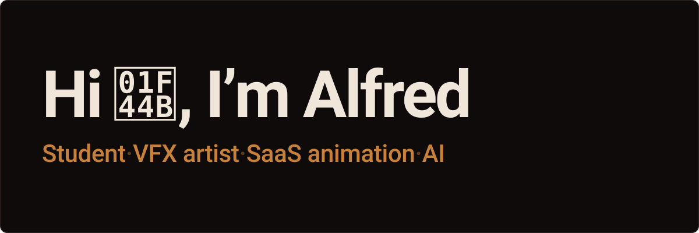
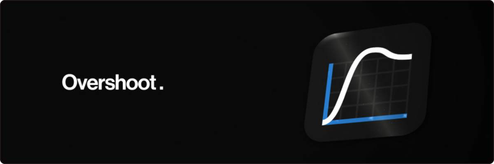
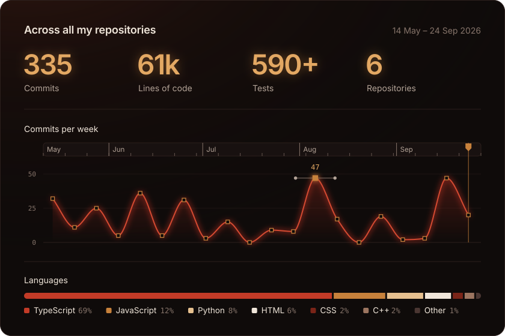

## Overshoot

I make motion for software: demo films, launch videos, and product animation that feels as good as the interface itself. Most products have something clever going on in the first few seconds. I help make sure people see it before they click away.

I work as Overshoot, mostly with founders and small product teams. Everything is animated by hand in After Effects, often from real interfaces rebuilt layer by layer.

[Overshootfx.com](https://overshootfx.com)

## Stack

<b>Using</b> 

<b>Learning</b> 

## Selected projects

### Protocol

After training for a while I wanted to progress faster. Recent sports science had most of the answers: how many hard sets grow a muscle, how close to failure they need to go, when a deload pays off. None of it was written for someone standing at a squat rack.

Protocol turns that research into a plan you can follow without reading any of it. Open it before the gym and today's session is already decided: the movements, the exact weight and reps for every set, and how close to failure to take them. Using it feels like having a friendly coach. Behind that sits a statistical model of you as a lifter that updates after every set and bends the plan around the exercises you prefer.

What it's like to use

- You pick the weekdays you train. Miss one and the session waits for you.
- Tap the session title to train something else, and the rest of the week rearranges around it.
- When a lift stalls, the plan changes the stimulus.
- Deloads come from accumulated fatigue, so a hard month earns one and two easy weeks don't.
- If you misjudge how many reps you had left, it learns your bias and corrects for it.
- One goal sets both training and food, and calorie targets follow your bodyweight trend.
- The Focus screen predicts how alert you'll be through the day from your sleep and caffeine, and checks itself now and then with a 3-minute reaction test. It places deep work, study, meetings and the workout where each fits best.
- It works offline in the gym and syncs later.

How it's built

- The app stores one thing: an append-only log of sets, check-ins, weigh-ins and answers. The athlete model is rebuilt from that log and memoized against its version, and the plan, loads, volume and calories are derived on every read, so a stale plan can't exist.
- Estimated one-rep maxes run through Holt's level-and-trend filter, a Kalman filter with fixed gains. A bad session moves the estimate by a fraction of the surprise, and a real change still registers.
- Reps-in-reserve bias is measured from your own sets. A set taken to failure is compared with an earlier set at the same load in the same session, corrected for the reps lost to fatigue in between, and every later target accounts for the difference.
- Seven parameters are learned per lifter: strength, fatigue, RIR calibration, dose-response, recovery, adherence and exercise affinity. Each is shrunk toward a population prior with weight n/(n+k), which keeps week one sensible and makes month three personal.
- Rep targets model set-to-set fatigue, so three sets of 8 at one weight are prescribed as 8, 8, 7. Fatigue debt builds per muscle and for the whole body and decides when a deload comes. A volume controller adds a set, holds, backs off or stops for each muscle, using the local OLS slope of progress against volume as its marginal return.
- Nutrition starts from Katch–McArdle when body composition is known and Mifflin–St Jeor otherwise. Bodyweight is smoothed with an EWMA and trended from the two halves of a 28-day window. After 10 days, calories steer toward a target rate (+0.35% of bodyweight a week to build, −0.7% to lean out) inside a 0.15% deadband, capped at 150 kcal a week and rounded to 10 kcal.
- The Focus model combines sleep pressure with a 14-day sleep-debt term, a circadian rhythm fitted as 24- and 12-hour harmonics in closed form, and a one-compartment caffeine model with Emax masking. A ridge regression over 11 features fits it to your focus ratings, with the reaction tests calibrating the rating scale. The regression is VIF-guarded, bootstrapped by whole days and solved with a hand-written Cholesky decomposition.
- The planner simulates the day in 96 fifteen-minute slots after a 56-day warm-up, averages a 9-run ensemble, and re-simulates after each of up to 8 placements. Randomized micro-trials test open questions on you, such as whether a walk beats a phone break, with arms assigned by an FNV-1a hash of the date and block.
- `src/core` is pure TypeScript with no React or database code, and Vitest covers the engine, model, nutrition, focus, sync and migrations. The app runs on Next.js 16 and React 19, offline-first in IndexedDB through Dexie, and syncs to Upstash Redis behind a jose-signed http-only cookie.
- Updates can't strand data. Facts carry stable IDs, so sync merges as a set union, and new schema versions only add optional tables.

[Try Protocol](https://protocol-xi-six.vercel.app/)

### Archvfinds

Cross-border shopping runs on buying agents: services that purchase from Chinese marketplaces like Taobao and Weidian, since those platforms don't ship internationally on their own, then inspect the order and forward it. Every agent runs its own storefront with its own link format, so a product link that opens cleanly through one agent is dead on arrival for a shopper using another, and the sites that tried to catalog finds across agents were slow, cluttered, or just not worth trusting.

Archvfinds is the catalog I wanted: fashion finds from archive labels and Instagram brands, built on a fast static site with one link system underneath. Pick a buying agent once, and every product link on the site resolves through it automatically.

What it's like to use

- The agents page compares every supported agent, and a 30-second quiz suggests one if you're unsure.
- You can browse by brand, item type or outfit, or search the catalog. A filter shows only finds with QC photos, the warehouse photos an agent takes before an order ships.
- Prices show in your currency, and there's no account to make.
- A Discord bot posts a curated find on Monday, a cop-or-drop poll on Thursday and a QC pick on Saturday.

How it's built

- The site is a static Next.js 15 export on Vercel, built from JSON, so no server runs when a page loads. Build-time matchers infer each product's brand and item type from its name, and those inferences generate the brand and category hub pages automatically.
- One link builder covers every agent, translating each product into that agent's own mix of path segments, query parameters and URL encoding, with a fallback for the links it can't convert.
- Sorting by popularity decays repeat brands and interleaves categories, so no single label can dominate a page.
- Analytics are first-party and privacy-first: a per-tab session id lives only in sessionStorage, no cookies get set, and nothing is tracked outside the production site. A separate panel counts visits as a rotating, salted hash of IP and day, so a unique visitor can be counted without the IP itself ever being stored.
- The Discord bot checks every 30 seconds for a scheduled post and never double-posts, since each slot is keyed by date and a restart picks up exactly where it left off. A Fisher–Yates queue also keeps the same brand from posting twice in a row.
- Poll votes are hashed per message and per voter, so the same person votes differently on every poll while the totals stay honest, and the voter hashes themselves age out after 30 days.
- Discord doesn't replay events a bot missed, so it snapshots its member list to disk and diffs it on startup to catch anyone who left while it was offline.

[Archvfinds.com](https://archvfinds.com)

### Local LLMs

I wanted to run language models from my own apps and devices without routing every request through someone else's server or paying per token. Ollama runs the models locally, sitting behind a small gateway that makes them look like any other API to whatever I'm building.

How it's built

Running models locally starts as an economic choice: once inference runs on hardware you already own, it's free, and using a model stops being a metered decision. Privacy comes along for free too, since nothing ever leaves the machine. And the gap that used to justify paying for frontier access keeps narrowing: open models now handle most everyday tasks well enough that reaching for a paid API is often just habit.

### Microcontrollers and hardware hacking

I like hardware I can open up and make do something it wasn't sold to do. Most of it is ESP32 boards. I wire bare screens, touch panels and camera modules from their pinouts and datasheets, flash my own firmware onto off-the-shelf boards and gadgets, salvage and solder parts, and probe UART, I2C and SPI lines with a multimeter or logic analyzer to see what a board is actually doing.
